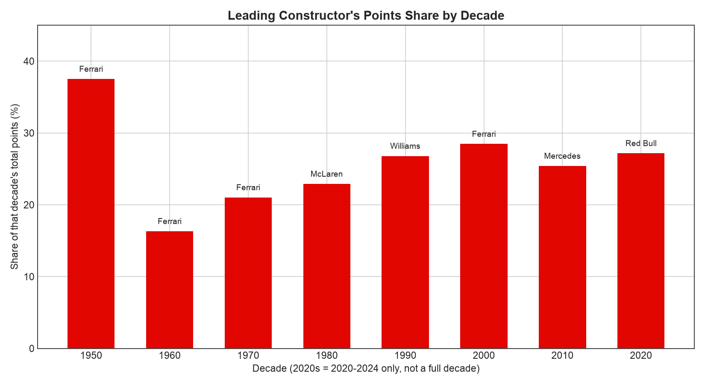
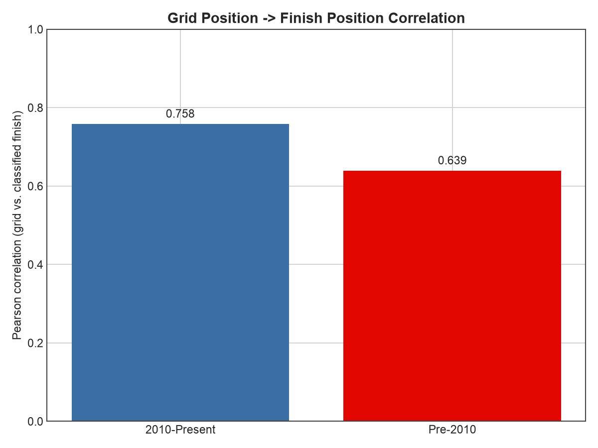
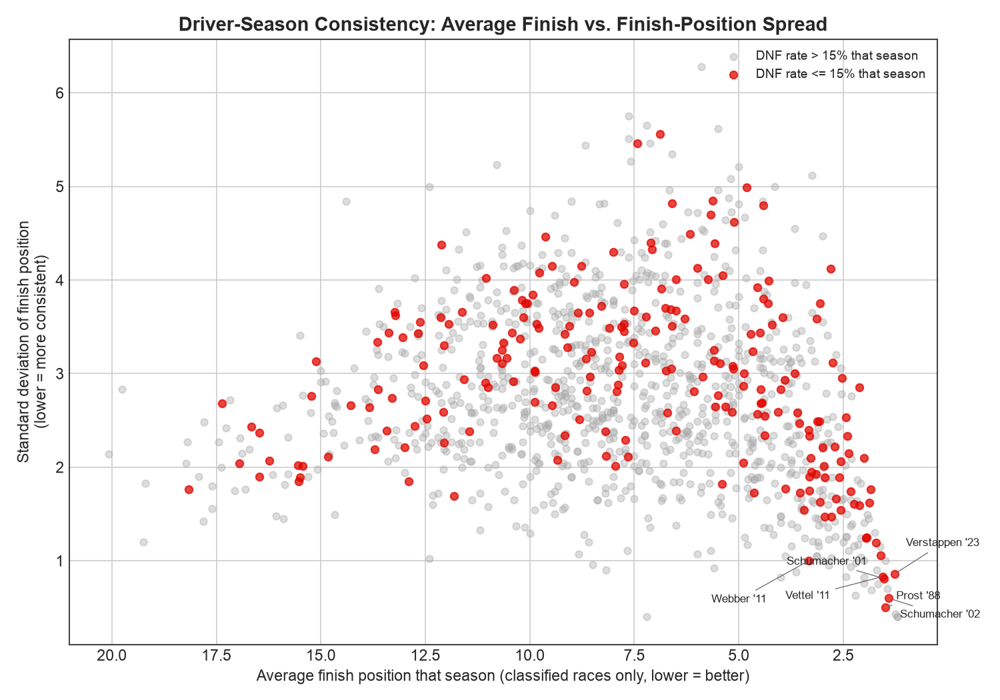
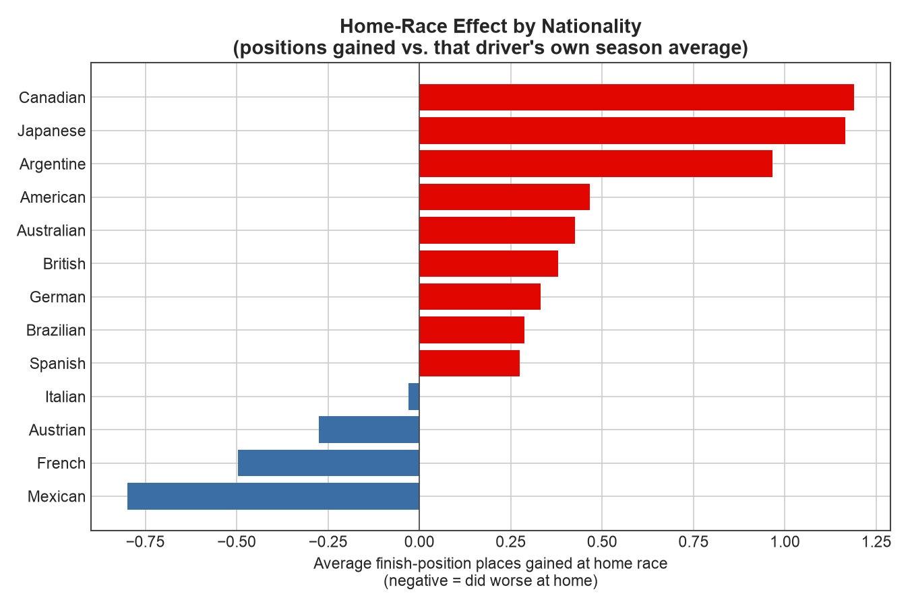
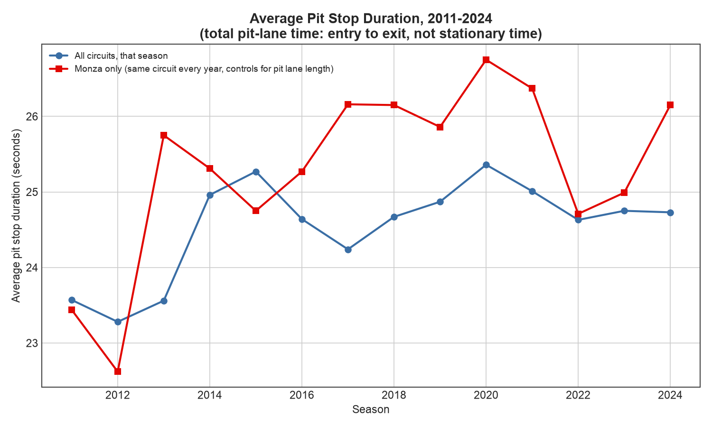
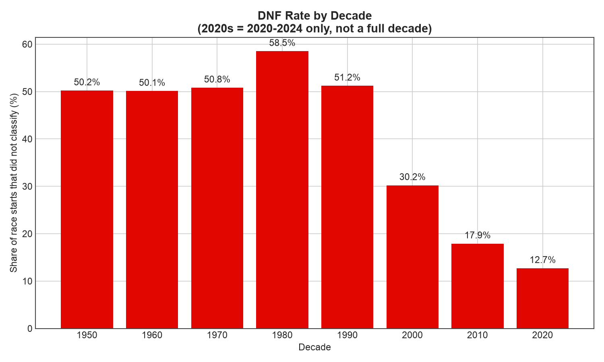

# Grid, Glory, and the Ones Who Never Won: 75 Years of F1 in SQL

*A SQL + Python case study on the Ergast Formula 1 dataset, 1950-2024.*

## Business context

If you're a performance analyst working for a team, a broadcaster building a season narrative, or a sponsor deciding where marketing spend actually lands, "F1 is competitive" isn't useful on its own — you need to know *how much* qualifying still matters before you invest in a Saturday-specialist driver, *which* circuits chew through cars badly enough to justify extra spares, *whether* a home race is actually worth the marketing premium teams pay for it, and *who* your pit crew should be benchmarked against. This analysis runs 75 years of real Grand Prix results through SQL — window functions, a manual Pearson correlation, a self-join for home-race effects — to answer exactly those questions, and finds a few results that cut against the sport's own popular narrative.

## Key findings

- **Grid position predicts the result *more* now than before the 2010 aero-rules era, not less.** Pearson correlation between grid and classified finish is **0.639** pre-2010 versus **0.758** from 2010 onward — the opposite of what "the rules made overtaking easier" would predict. Qualifying performance is a stronger determinant of race results today than in any prior era in this dataset.
- **Reliability improved dramatically, but not on a straight line.** DNF rate held steady around 50% from the 1950s through the 1970s, then **got worse in the 1980s (58.5%)** — the turbo era's notoriously fragile engines — before falling sharply: 30.2% (2000s), 17.9% (2010s), **12.7% in the 2020s**. A modern grid finishes more than four times as reliably as a 1980s one.
- **Pit stops have not gotten faster — because this dataset can't measure the number everyone's thinking of.** Ergast's pit-stop timing is total pit-lane time (entry to exit), not the sub-2-second stationary tire change F1 broadcasts headline — even the *fastest* recorded stop in any year here is 13-16 seconds. Controlling for pit lane length by tracking one circuit (Monza) across every season 2011-2024, average duration went from **23.4s (2011) to 26.2s (2024)** — flat-to-slightly-up, not down. **Red Bull is the fastest pit crew of the last three seasons (24.07s average)**, consistent with their real-world reputation, which is the more reliable read from this data than any cross-year trend.
- **Constructor dominance has gotten less extreme, not more.** Ferrari took **37.5%** of all points in the 1950s and **28.5%** in the 2000s; the most dominant team of the 2020s so far, Red Bull, holds **27.2%** — every decade from the 1980s onward has had a "dominant" constructor topping out in the low-to-mid 20s, versus the near-monopolies of F1's first two decades.
- **The home-race effect is real for some nationalities and genuinely absent — or reversed — for others.** Pooled across all drivers, the effect is small (**+0.16 positions** on average, 692 home-race instances). But split by nationality, Canadian drivers gained **1.19 positions** at home and Japanese drivers **1.17** (both modest sample sizes — 14 and 19 instances), while French drivers (87 instances, a solid sample) **lost 0.50 positions** at their home race and Italians (118 instances) were essentially flat (-0.03). There's no single "home advantage" story here — it depends who you are.
- **Stirling Moss is, by the numbers, the best driver never to win a title — not narrowly, but four times over.** He finished championship runner-up in **1955, 1956, 1957, and 1958**, missing the title by as little as **1 point in 1958**. The single closest near-miss in the dataset by any measure is **Felipe Massa's 2008 season — beaten by exactly 1 point**, at his own home race, one of the most-replayed moments in the sport's history. Wolfgang von Trips lost 1961 by the same 1-point margin, in the season in which he was killed at Monza before it ended.

## Recommendations

1. **Weight qualifying performance more heavily than grid-day narrative suggests, not less.** Because the grid-to-finish correlation has *risen* since 2010, a team or driver evaluation that treats Saturday as a formality and Sunday as "where racing happens" is working against what the modern data actually shows — qualifying is the bigger lever now, not the smaller one.
2. **Budget spares and reliability engineering by circuit, not just by car generation.** DNF rate by circuit ranges from **13.1% (Yas Marina)** to **62.3% (Long Beach)** among tracks with meaningful history — largely street circuits and older layouts. A team or broadcaster planning attrition-dependent strategy (safety car timing, back-of-grid points chances) should weight this by track, not assume a flat league-wide rate.
3. **Don't sell "home advantage" as a universal sponsorship premium.** The pooled effect is small, and the by-nationality breakdown shows real variation, including two solid-sample nationalities (French, Italian) with flat-to-negative home results. A marketing case for a home race should be built on that specific driver's or team's own history, not on a generic home-field-advantage assumption.

## Charts

### Constructor dominance by decade

### Grid position vs. finish position

### Driver-season consistency

### Home-race effect by nationality

### Pit stop duration trend

### DNF rate by decade

## Notes on two findings that need more than the headline number

**Driver consistency isn't quite "steadiness."** Sorted purely by finish-position variance, the top of the list mixes genuinely dominant championship seasons (Alain Prost 1988, Michael Schumacher 2001-2002, Max Verstappen 2023 — all near-zero DNF rate, near-guaranteed podiums) with a few high-DNF seasons (Stirling Moss 1958, 50% DNF rate) that only look "consistent" because the *handful* of races the driver actually finished were all similar results. The chart separates these (red = DNF rate ≤15% that season) — the genuinely steady story is the reliable-car cluster in the bottom-right, not the raw ranking.

**"Best season nobody remembers" surfaced one story that isn't obscure at all.** Felipe Massa's 2008 loss by 1 point, at his home Brazilian Grand Prix, is among the most replayed moments in F1 history — the query surfaced it purely on the numbers, which is a reasonable sanity check that the "closest title miss" logic is measuring something real, even though the section's framing (nobody remembers) doesn't fit this particular case.

## Limitations

- **Session-level data has real, disclosed coverage gaps.** `pit_stops.csv` starts in 2011 and `lap_times.csv` in 1996 — F1 didn't record either electronically before those points. The pit stop trend and analysis is scoped to 2011-2024 only; no claim in this report compares pit stop timing to any earlier era.
- **Pit stop duration measures total pit-lane time, not the stationary tire-change time F1 broadcasts as its headline number.** This dataset doesn't separate the two, and the cross-year trend is further confounded by which circuits (different pit lane lengths and speed limits) were on the calendar in a given season — the Monza-only series in this report exists specifically to control for that, and is the more trustworthy read of the two lines on that chart.
- **Home-country mapping is necessarily incomplete.** Driver nationality (e.g. "British") and circuit country (e.g. "UK") use different vocabularies, mapped by hand for the ~26 nationalities with a matching circuit in this dataset. Dual nationalities (e.g. "American-Italian") and nationalities with no corresponding circuit (e.g. Polish, Finnish, New Zealander) are excluded from the home-advantage analysis entirely, not guessed at.
- **The consistency and DNF-by-circuit rankings both use fixed minimum-sample floors** (≥10 starts/≥5 classified finishes per driver-season; ≥200 starts per circuit) that structurally favor the modern era, when F1 ran longer seasons and circuits hosted more races. A 1950s driver or circuit with genuinely excellent underlying reliability could fall below these floors simply from having fewer total starts on record.
- **The 2020s decade bucket covers 2020-2024 only** (5 seasons), not a full ten years, in every chart and table that groups by decade — shown as-is rather than extrapolated to a full decade.
- **This is results data, not race-conduct data.** The dataset has no lap-by-lap position changes, no overtake counts, and no safety-car/red-flag timing before recent years — the grid-vs-finish correlation measures the *outcome* relationship, not *why* it changed (aero regulations are the most commonly cited explanation for reduced overtaking in this era, but this dataset can't isolate that specific mechanism from others that changed over the same period, like tyre rules or track design).

---
*Data: the Ergast F1 database / Kaggle `rohanrao/formula-1-world-championship-1950-2020`. Full methodology in [README.md](README.md).*
