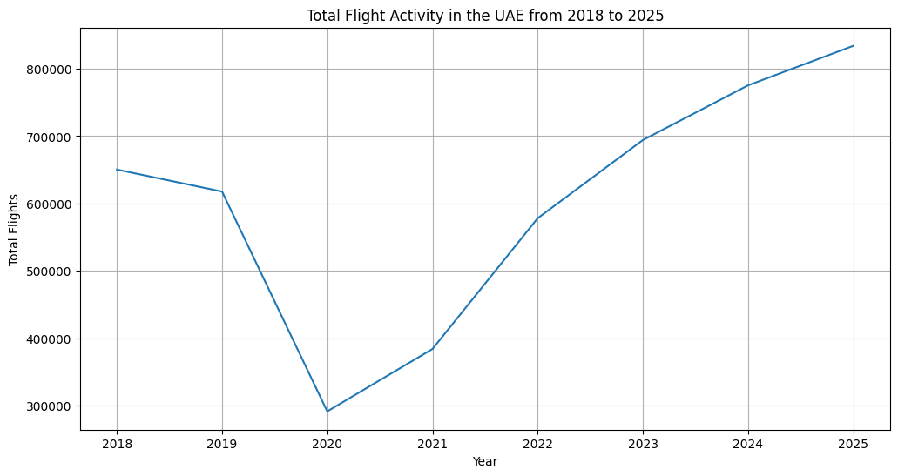
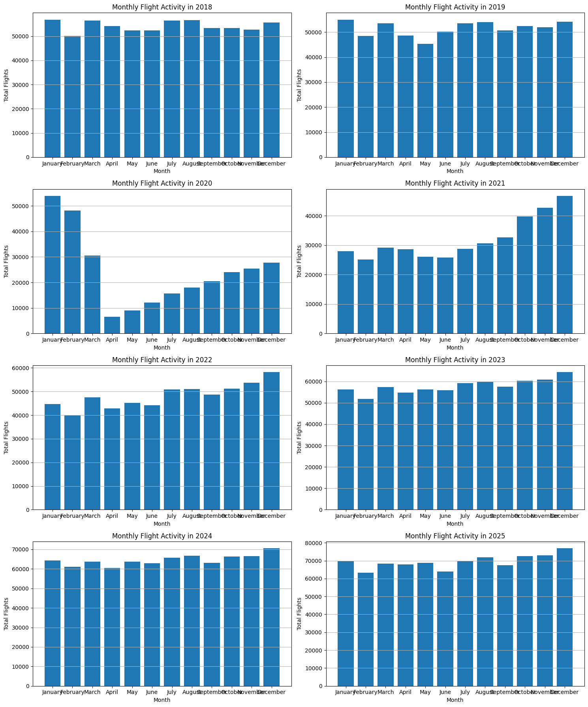
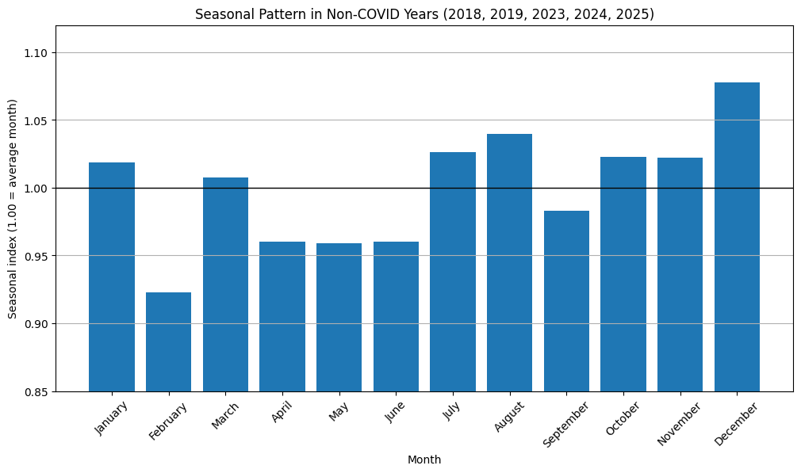
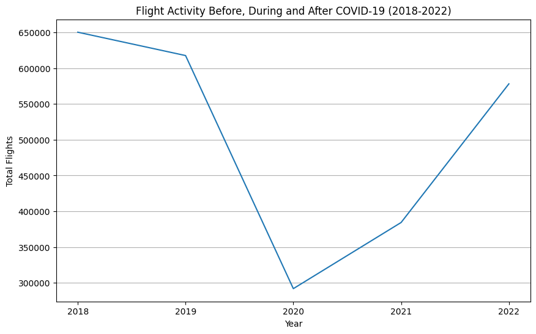
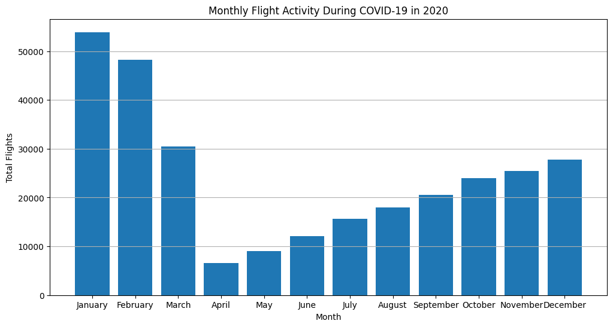
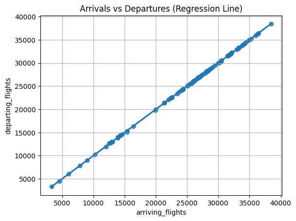
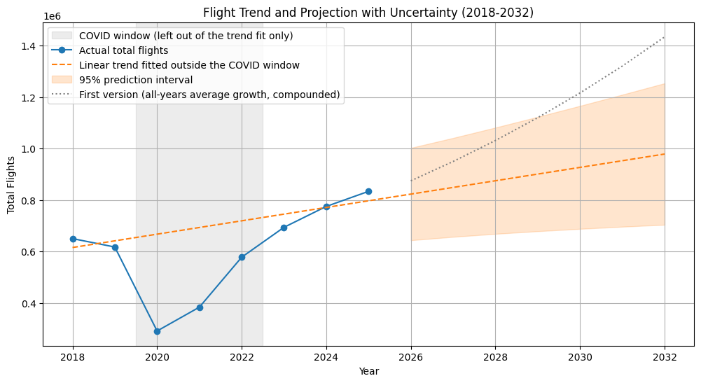
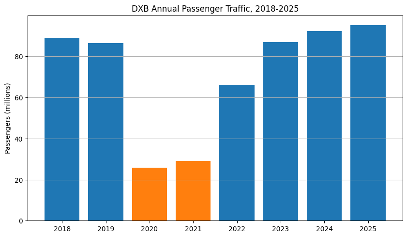
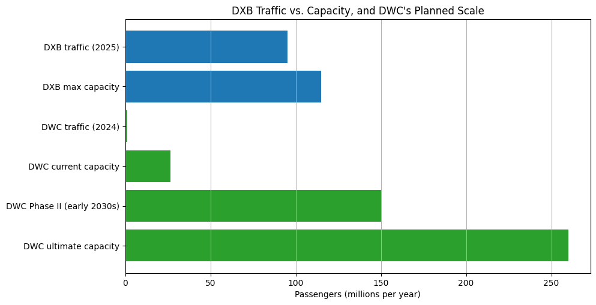

# What Eight Years of UAE Flight Data Shows About Dubai's Move to DWC

*Portfolio card copy is at the bottom of this file, ready to drop into index.html.*

Dubai plans to shift its main airport operations from Dubai International (DXB) to Al Maktoum International (DWC) over roughly the next decade. That's a large claim to take on faith, so for my MSc Programming for Data Science coursework I went looking for actual flight data to see what the numbers say about it. This project reworks that coursework into two parts: eight years of monthly UAE flight counts from Bayanat.ae (January 2018 through December 2025, 96 months), and a second, separately sourced look at DXB and DWC's own passenger and capacity figures, since the first dataset turns out not to answer the DXB/DWC question on its own. Both parts live in a single notebook, `AJA_Prog4DS_Project_v3.ipynb`, and the original coursework submission is kept in `original/` for comparison.

## Getting the scope right

I started out treating the Bayanat dataset as DXB traffic, since Dubai is the obvious reason to care about UAE aviation data and the dataset's own description doesn't name an airport. The numbers said otherwise. The UAE's statistics centre reports 694,050 civil aircraft movements across all UAE airports in 2023, 771,800 in 2024, and 828,570 in 2025, against 694,130, 775,248, and 833,789 in this file, close enough across three separate years to be measuring the same thing. Dubai Airports' own figures for DXB alone are 440,300 movements in 2024 and 454,800 in 2025, only about 55% to 57% of this file's totals for those years. So the dataset covers UAE airports as a whole, not DXB by itself, with DXB as the largest part of it. Everything below is framed as UAE-wide for that reason, and it's also why a second part exists: this correction meant the first dataset couldn't carry the DXB/DWC question on its own.

## Eight years, one clear trend

Total flight volume dipped slightly in 2019 (617,714, about 5% below 2018's 650,382), then dropped by more than half in 2020 as COVID-19 hit (291,755). From 2021 it climbed every year: 384,262, then 578,156, then past pre-pandemic levels in 2023 at 694,130, then 775,248 in 2024, and a record 833,789 in 2025.

Laid out year by year, the same story shows up at the monthly level: a normal, mildly bumpy shape in 2018 and 2019, a collapse and slow crawl back in 2020, and a steady month-over-month build from 2021 onward.

## Finding the real seasonal pattern

Pooling every month's total across all eight years looks like the obvious way to check for seasonality, until you notice what's actually driving the shape: 2020's collapse drags April through June down, and the sharp recovery in 2021 and 2022 pushes the second half of the year up, for reasons that have nothing to do with the calendar. Both are one-off events dressed up as a seasonal signal.

The fix was a seasonal index instead: each month's share of its own year's total, scaled so 1.00 means an average month, computed only across years untouched by COVID (2018, 2019, 2023, 2024, 2025).

What's left once the pandemic years are out of the average is a real but modest pattern. December runs about 8% above an average month, which fits the holiday period, February sits about 8% below (partly because it's the shortest month), and April through June run about 4% below. January through November otherwise stays close to flat. The UAE doesn't really have an aviation off-season. It has one mild lift around December.

## COVID, up close

The pandemic's effect is visible in every chart in this project, but it's worth isolating on its own. UAE flight activity fell from over 600,000 a year to 291,755 in 2020, and the monthly average dropped from 54,199 in 2018 to 24,313.

Zooming into 2020 month by month shows the actual shape of the collapse: April 2020, the month after the first lockdowns, falls to roughly an eighth of a typical month's volume, and the months that follow recover only slowly while restrictions stay in place.

The recovery shows up in the yearly numbers too. 2021 (384,262) and 2022 (578,156) climbed but hadn't reached 2018 levels yet. 2023 (694,130) finally passed them, and 2024 and 2025 kept climbing from there.

## Arrivals and departures, together

Arrivals and departures correlate at 0.999977 across all 96 months, which is expected (a flight that arrives has to leave again) but still worth checking before trusting anything built on the combined total. It also says something about how these airports operate: neither direction runs consistently ahead of the other, which fits a hub built around connections rather than one-way traffic.

## The projection, and where the first version went wrong

Part of this project asks what flight volume might look like by 2032, as background for a move that's itself described as playing out over roughly a decade. My first attempt took each year's growth rate and averaged them: -5.0% in 2019, -52.8% in 2020, +31.7% in 2021, +50.5% in 2022, +20.1% in 2023, +11.7% in 2024, and +7.6% in 2025 (2025 itself estimated from its first quarter at the time, a shortcut that turned out to land about 3% below where 2025 actually finished). Averaged straight across, those rates gave 8.6% a year, compounded seven years out to a 2032 estimate of 1.43 million flights.

That number is wrong in an instructive way. Dropping just the 2020 crash from the average doesn't fix it: the average jumps to 19.4%, because the rebound in 2021 and 2022 off a depressed base stays in, and a rebound isn't the same thing as normal growth. Compound growth from 2018 to 2025 alone, skipping the COVID years entirely, comes out to 3.6% a year, under half of what the naive average said. Averaging year-on-year rates blends a collapse, a rebound, and a slowing normal growth path into one number, and that number is a poor input for a seven-year projection.

The fix was to stop averaging growth rates and fit a trend line to the yearly totals instead, using only the years outside the COVID window: 2018, 2019, 2023, 2024, 2025. The COVID years still appear in the plot below, they just don't pull the line.

That fit adds 25,917 flights a year (R² = 0.82) and puts 2032 at roughly 978,600 flights, with a 95% prediction interval of about 704,000 to 1.25 million, well under the first version's 1.43 million. The honest caveat: 2025's actual total already sits 4.6% above what the fitted line predicts for that year, so the line probably understates the next few years more than it overstates them. A range built from five yearly points is also inherently wide, and it only describes what happens if the recent pattern continues, not a forecast of what will happen.

## Why UAE-wide data can't finish the job

Everything above describes UAE aviation as a whole, which is exactly the limit for the question I actually started with. The scope check earlier in this project already ruled out using these numbers to say anything specific about DXB itself: the Bayanat dataset has no per-airport breakdown, and DXB is the largest part of it, not all of it. Answering the DXB/DWC question needed different data, so the second part of this project uses Dubai Airports' own published figures for DXB and DWC directly.

DXB doesn't publish a single downloadable dataset the way Bayanat does, so these figures are compiled by hand from Dubai Airports' press releases and fact pages. 2019 is the one year they don't state a passenger figure for directly, filled in from a third-party aggregator (roadgenius.com) and marked as such in the underlying table. Aircraft movement counts for 2018 and 2022 are left blank rather than estimated, since passenger volume is the more relevant number for a capacity question anyway.

## DXB's own traffic

DXB's passenger numbers trace a similar shape to the UAE-wide movement counts: a small dip in 2019 (86.4 million, down from 89.1 million in 2018), a deeper collapse to 25.9 million in 2020 and 29.1 million in 2021, and a slower climb back that only passes the 2018 peak in 2024 (92.3 million). 2025 was DXB's busiest year on record at 95.2 million passengers, about 7% above its previous 2018 peak.

## DXB against its own ceiling, and what DWC is being built for

The number that actually matters for the DWC question isn't how many passengers DXB carried, but how close that is to what DXB can physically hold. Dubai Airports' CEO stated in September 2026 that DXB's maximum infrastructure capacity is around 115 million passengers a year, separate from the airport's forecast to reach 100 million by the end of 2027, which is a traffic milestone, not the capacity ceiling. Against that 115 million ceiling, DXB's 95.2 million in 2025 puts it at about 83% utilization: well used, but not yet out of room.

DWC, by comparison, currently carries almost none of that load: about 1.1 million passengers in 2024, roughly 1% of DXB's 2025 traffic, against its own current terminal capacity of 26.5 million. What's being built there goes well past matching DXB. The approved Phase II expansion adds 150 million a year of capacity in its first stage alone, expected in the early 2030s, rising to an ultimate capacity of 260 million a year across five runways once complete, more than double DXB's own ceiling.

## What this does, and doesn't, show

Put together, the two parts show real and growing demand (DXB at a record 95.2 million passengers in 2025, still climbing) running up against a finite capacity ceiling (115 million), alongside a deliberate, already-underway plan to build elsewhere at a scale DXB could never reach on its own. That combination is evidence that the demand and the planned capacity are both real. Whether moving to DWC is the right call in economic or operational terms is a separate question, and answering it would need things this project doesn't have: long-term demand forecasts, what the expansion costs against alternatives, and how Dubai's connectivity needs are expected to change. This project can speak to the demand-and-capacity backdrop behind the DWC decision. The decision itself is outside what this data can settle.

## Limits

A few limits are worth stating plainly. The Bayanat series is short, 96 months, so the projection's range rests on five yearly points once the COVID years are set aside, and a longer run of normal years would narrow it considerably. Part 1's dataset has no passenger, gate, or runway figures, only flight counts, which is part of why Part 2 exists at all. Part 2 itself isn't a single sourced dataset; it's compiled from public press releases and fact pages, with one year of DXB passenger data coming from a third-party aggregator rather than Dubai Airports directly. None of that changes the overall picture, but it's why this project treats its own projection as a range to reason with rather than a number to repeat.

---

## Portfolio card copy (for index.html)

**Title:** What Eight Years of UAE Flight Data Shows About Dubai's Move to DWC

**Meta line:** Python · pandas · NumPy · Matplotlib/Seaborn · SciPy

**Description:** An MSc data analysis project on eight years of UAE flight movements and Dubai Airports' own DXB/DWC figures, tracing growth, seasonality, and COVID recovery, then testing what the evidence does and doesn't say about Dubai's planned shift to Al Maktoum International.

**Stat callouts:**
- 96 months of UAE flight data (2018-2025)
- 833,789 flights in 2025, a record high
- DXB at 83% of its 115M capacity ceiling

**Links line:** GitHub — Coming Soon · Notebook — Coming Soon
